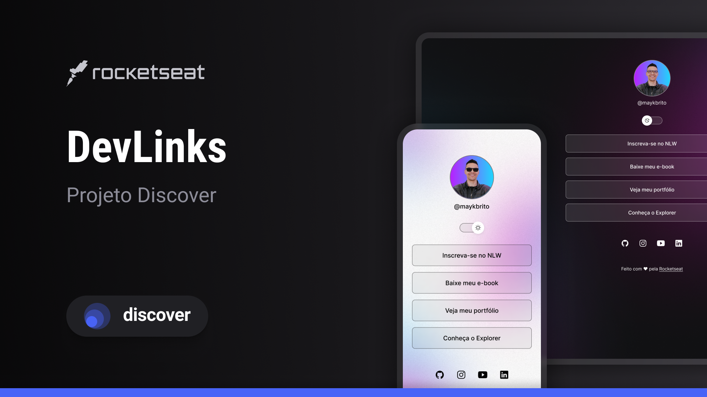

<h1 align="center">Dev Links</h1>

Programa exclusivo e gratuito, promovido pela Rocketseat para ensino de tecnologias web.

  

 

  

## 💻 Tecnologias

Esse projeto foi desenvolvido com as seguintes tecnologias:

- HTML e CSS
- JavaScript
- Git e Github
- Figma

## 📝 Projeto

O Dev Links é um agregador de links para usar como cartão de visitas online.

## 🎨 Layout

Você pode visualizar o layout do prjeto através [desse link](https://www.figma.com/community/file/1187422022288947321/devlinks-projeto-discover). É necessário ter conta no [Figma](https://www.figma.com) para acessá-lo.

## 📄 Licença

Esse projeto está sob a licença MIT.

---

Feito com Feito com ❤ by Rocketseat 👋 [Participe da nossa comunidade!](https://discord.gg/rocketseat)
